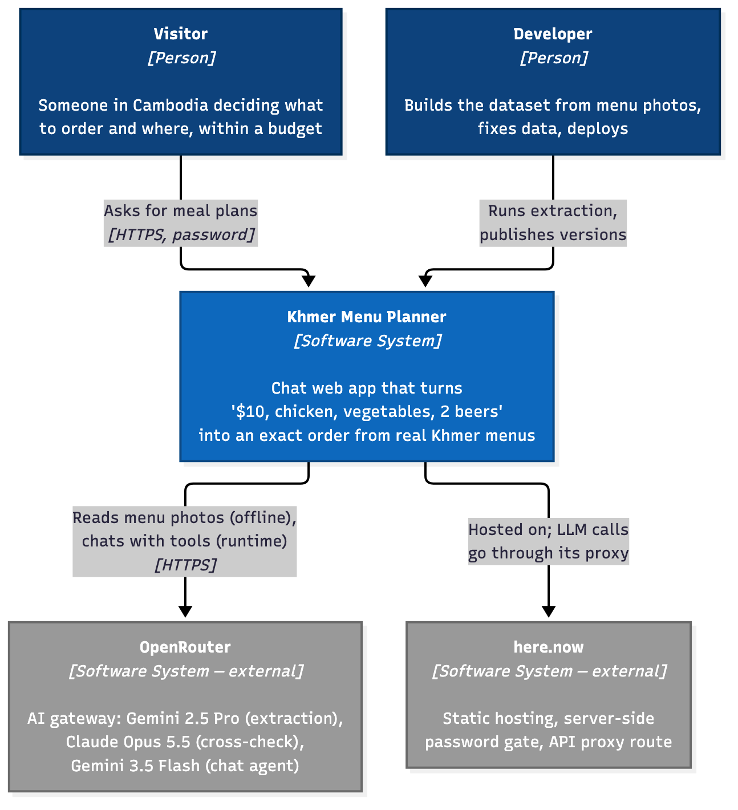
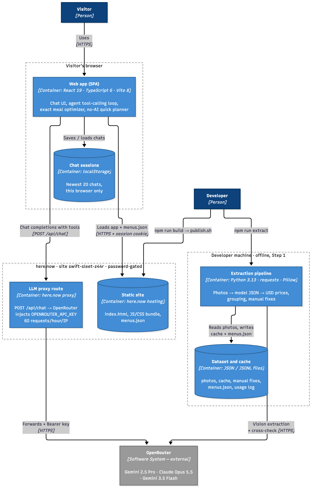
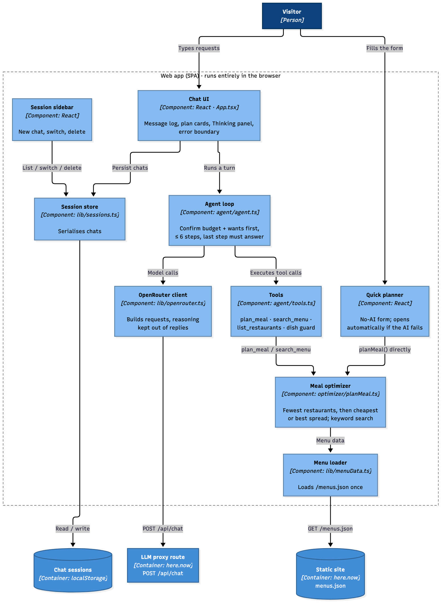
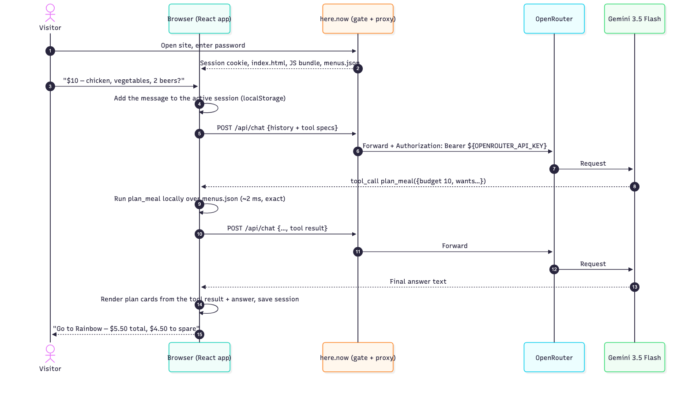
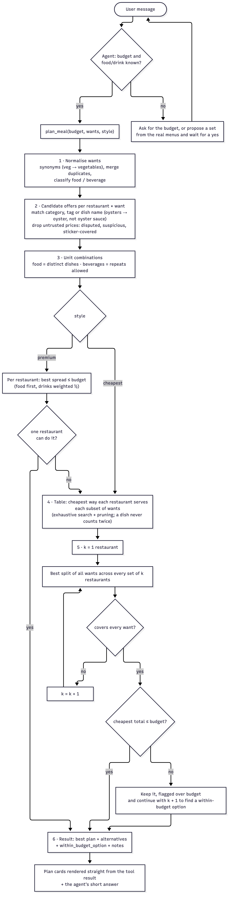

# Khmer Menu Planner

A web app that answers:

> "I have a budget of $10. I want chicken, some vegetables, and a couple of beers. What should I order, and from where?"

using ~30 restaurant menus from Cambodia, written in Khmer.

**Live:** https://swift-sleet-z44r.here.now/ (password-protected; ask the owner for the password)

| Step | What | Status |
|---|---|---|
| 1 | Turn menu photos into a structured dataset (OCR + translation + USD prices) | ✅ done — see below |
| 2 | Meal-plan algorithm (fewest restaurants, then cheapest) | ✅ implemented |
| 3 | Chat agent that calls the algorithm as a tool | ✅ implemented + deployed |
| 4 | Deploy to here.now (static site + proxy route for the LLM) | ✅ live |

---

## Project layout

```
data/
  raw/<folder>/*.png        menu screenshots, one folder per restaurant (manual grouping)
  raw/_original_names.json  original screenshot file names
  restaurant-names.json     manual restaurant names (with evidence)
  menus.json                ⭐ final dataset used by the app
  extraction-report.json    accuracy, cost, items needing review
  cache/                    per-image model outputs (gitignored)
scripts/
  extraction/               step 1 pipeline (Python) + requirements.txt
  extract.mjs, lib/         first JS version of the same pipeline (kept for reference)
  export-session.mjs        exports Claude Code chat logs to ai-session/
src/                        React chat app (Vite)
public/.herenow/proxy.json  here.now proxy route: /api/chat -> OpenRouter
logs/llm-usage.jsonl        every LLM call: model, tokens, cost, latency
ai-session/                 readable logs of the AI-assisted working sessions
PLAN.md / PLAN.txt          the plan, accuracy prediction and assumptions (written before processing)
```

## Setup

```bash
cp .env.example .env          # add OPENROUTER_API_KEY (all AI calls go through OpenRouter)
npm install                   # web app
uv venv scripts/extraction/.venv
uv pip install -p scripts/extraction/.venv/bin/python -r scripts/extraction/requirements.txt
npm run dev                   # local app; /api/chat is proxied to OpenRouter with the key from .env
```

Secrets live only in `.env` (gitignored). In production the OpenRouter key is a here.now account variable injected by the proxy route, so it never reaches the browser.

---

## System design

System design in the [C4 model](https://c4model.com): context → containers → components, plus a dynamic view of one chat request further down. Diagrams use C4 notation (person / container / database shapes, `[Container: technology]` labels, dashed boundaries) and are rendered to PNG from the Mermaid sources in [docs/diagrams/](docs/diagrams/) with `npm run diagrams`.

### C4 Level 1 — System context



<sub>Source: [docs/diagrams/c4-1-context.mmd](docs/diagrams/c4-1-context.mmd) · regenerate with `npm run diagrams`</sub>

### C4 Level 2 — Containers



<sub>Source: [docs/diagrams/c4-2-containers.mmd](docs/diagrams/c4-2-containers.mmd) · regenerate with `npm run diagrams`</sub>

### C4 Level 3 — Components of the web app



<sub>Source: [docs/diagrams/c4-3-components.mmd](docs/diagrams/c4-3-components.mmd) · regenerate with `npm run diagrams`</sub>

### Tech stack

| Layer | Technology | Notes |
|---|---|---|
| **Chat agent model** | **`google/gemini-3.5-flash`** via OpenRouter | Set by `AGENT_MODEL` in `.env`. Temperature 0.2, `max_tokens` 4000, `reasoning: {effort: "low"}` (reasoning kept out of the reply) |
| **Agent framework** | **None: a hand-written tool-calling loop** ([src/agent/agent.ts](src/agent/agent.ts), ~80 lines) | OpenAI-compatible Chat Completions with `tools` / `tool_calls`; up to 6 model steps, and the last is forced to answer (`tool_choice: "none"`). No LangChain or agent SDK: with three local tools it adds nothing, and an SDK would need a server, which here.now doesn't have |
| Agent tools | Plain TypeScript functions in the browser ([src/optimizer/planMeal.ts](src/optimizer/planMeal.ts), [src/agent/tools.ts](src/agent/tools.ts)) | `plan_meal` (exact optimizer), `search_menu` (keyword search), `list_restaurants`, plus a dish-name guard |
| Extraction model | `google/gemini-2.5-pro` via OpenRouter | Vision → JSON (Khmer + English + prices) |
| Cross-check model | `anthropic/claude-opus-5.5` via OpenRouter | Audits a random 30% of images |
| AI gateway | **OpenRouter** (`/api/v1/chat/completions`) | One key for all three models |
| Frontend | **React 19.3**, **TypeScript 6.0**, **Vite 8.3**, plain CSS | No UI library; Mermaid diagrams in this README only |
| Extraction pipeline | **Python 3.13** + `requests`, `python-dotenv`, `Pillow` ([scripts/extraction/requirements.txt](scripts/extraction/requirements.txt)) | A JS version is kept in `scripts/extract.mjs` for reference |
| Hosting | **here.now** static site + proxy route + server-side password | No server code or Docker (here.now serves static files only) |
| Tooling | `oxlint`, `uv` (Python venv), Claude Code (AI pair programming) | Session logs in [ai-session/](ai-session/) |

### Where data is stored

| Data | Where | Who can see it | Lifetime |
|---|---|---|---|
| Menu photos (31 PNG) | `data/raw/<folder>/` on the developer machine; the original zip too | Developer only (never uploaded to the site) | Permanent |
| Per-image model outputs (extraction, cross-check) | `data/cache/` (gitignored) | Developer only | Until deleted; lets rebuilds skip model calls |
| Manual corrections | `data/restaurant-names.json`, `data/manual-fixes.json` (in git) | Repo readers | Permanent |
| **Final dataset** | `data/menus.json` (in git) → copied to `public/menus.json` → **served as `/menus.json`** | Site visitors **after the password** | Updated by `npm run extract -- --build-only` |
| LLM usage and cost log | `logs/llm-usage.jsonl` (local) | Developer only | Append-only |
| Secrets (OpenRouter key, here.now key, site password) | `.env` (gitignored); the OpenRouter key is also a **here.now account variable**, injected server-side by the proxy | Never sent to the browser (verified by a secret scan) | Revoke after the challenge |
| **Chat sessions** (messages, plan results, thinking steps) | Visitor's browser **localStorage**, key `khmer-menus.sessions.v1`, newest 20 chats | That browser only; no server copy | Until the user deletes them or clears site data |
| Chat messages sent for answers | Pass through the here.now proxy to OpenRouter → Google (Gemini) | Subject to OpenRouter / Google data policies | Not stored by this app |
| Site versions, password, proxy manifest | here.now account (`swift-sleet-z44r`) | Owner (version history); visitors see only the live version | Every publish is a version |

### Data flow 1 — offline extraction (Step 1)

1. **Prepare:** each PNG in `data/raw/<folder>/` becomes a full-resolution JPEG in `data/cache/jpeg/`.
2. **Extract:** the JPEG and a JSON-schema prompt go to Gemini 2.5 Pro through OpenRouter. The reply (items in Khmer + English, printed prices, categories) is cached in `data/cache/extract/<image>.json`, and each call is appended to `logs/llm-usage.jsonl`.
3. **Cross-check:** for a seeded random 30% of images, the image plus the extracted items go to Claude Opus 5.5, which returns per-item verdicts to `data/cache/crosscheck/`.
4. **Build (no model calls):**
   - Re-parse each printed price (Khmer digits → normal digits) and convert to USD at 4,000 ៛/$.
   - Group by folder, apply manual names and fixes, classify food or beverage.
   - Write `data/menus.json` and `data/extraction-report.json`.
5. **Ship:** `npm run build` copies `menus.json` into the bundle's `public/`, and `publish.sh` uploads `dist/` to here.now.

### Data flow 2 — one chat request (C4 dynamic view)



<sub>Source: [docs/diagrams/sequence-chat-request.mmd](docs/diagrams/sequence-chat-request.mmd) · regenerate with `npm run diagrams`</sub>

Key properties:
- **The model never sees the API key, and the browser never sees it either.** The key is added only inside the here.now proxy.
- **The model never computes prices.** All numbers come from `plan_meal` running in the browser, and the cards are drawn from that tool output.
- If the AI call fails, the **Quick planner** runs the same `plan_meal` straight from a form, with no network call beyond the static files.

## Step 1 — Menu extraction

### Approach

There are 31 screenshots (Google Maps photos of printed menus): rotated photos, glare, two-page spreads, Khmer numerals (១២,០០០), prices in riel (៛) and dollars, per-plate / per-kg / can-vs-bottle price columns.

Instead of a classic OCR engine (weak on Khmer), a **vision LLM reads each image and returns structured JSON directly**, and a second model audits a sample.

```
data/raw/*.png
   │ 1. prepare      PNG -> JPEG (Pillow, full resolution)
   │ 2. extract      google/gemini-2.5-pro: every item -> Khmer name (as printed), English name,
   │                 description, section, category, tags, prices[] (exact printed text,
   │                 amount, currency, variant, unit), confidence, notes
   │ 3. cross-check  anthropic/claude-opus-5.5 audits a random 30% of images item by item
   │                 (exists? Khmer spelling? translation? price? category?) + missed items
   │ 4. build        code (not the model) re-parses each printed price, converts Khmer digits,
   │                 converts to USD at a fixed 4,000 ៛ = $1, flags suspicious prices,
   │                 groups images into restaurants
   ▼
data/menus.json + data/extraction-report.json
```

Model choice: [SEA-Vision (2026)](https://arxiv.org/pdf/2603.15409) reports Gemini 2.5 Pro as the strongest general model on Khmer document OCR; Claude was used as an independent second opinion so the two models' errors are less correlated.

**The original Khmer is always kept** (`name_km`, `section_km`, `prices[].price_text`, `variant_km`, `unit_km`) next to the English, so any item can be checked against the photo (`source_image`).

### Run it

```bash
npm run extract                                      # all stages, cached (re-runs skip finished images)
npm run extract -- --crosscheck-rate 0               # extraction only
npm run extract -- --skip-extract --crosscheck-rate 0.3   # cross-check only
npm run extract -- --build-only                      # rebuild menus.json from cache, no model calls
npm run extract -- --help
```

### Manual refinement

The automatic output was refined by hand, without re-running any model:

1. **Restaurant grouping** — the images were sorted by hand into `data/raw/<folder>/`, one folder per restaurant. The model only finds a restaurant name on some pages, and it sometimes mistakes section headings for names.
2. **Restaurant names** — `data/restaurant-names.json` fixes names the model missed or misread, with the evidence for each:
   - Folder 3 → *Tbal Khmer* (logo on the menu edges, not detected)
   - Folder 6 → *Mhoub Bopha* (the other "names" were the headings "dishes" / "stir-fried dishes")
   - Folder 10 → *Bayon* (stylised logo misread as "Lilis")
   - Folder 11 → *Rainbow*: 4 photos merged (Rainbow logo, Rainbow-branded dishes, shared design, taken within 27 s)
3. **Item fixes:** `data/manual-fixes.json` holds hand corrections, each with its reason, and the item keeps a `manual_fix` note.
   - Reatry Battambong: 4 sticker-covered prices flagged `handwritten_sticker`, so the planner never uses them.
   - Rainbow: 9 dishes in the "chicken feet / chicken / duck / frog / eel" section re-categorised as chicken (one had been mistranslated as clams).
4. `npm run extract -- --build-only` re-applies all of this from cache in a second, for free.

Result: **12 restaurants, 546 items, 31 images.**

### Accuracy — predicted vs measured

The prediction was written in [PLAN.md](PLAN.md) before any image was processed. "Measured" is the cross-check: Claude auditing Gemini on 165 items from 10 randomly chosen images.

| Field | Predicted | Measured |
|---|---|---|
| Item exists (no hallucinated items) | — | 100% |
| Price | 88–93% | **97.0%** |
| Category (chicken / vegetable / beer …) | 90–95% | **97.0%** |
| English meaning | 85–90% | **92.7%** |
| Khmer spelling (exact) | 60–75% | **87.9%** |
| All fields correct | — | 79.4% |
| Missed items | — | 2 in 10 images |

#### How these numbers were measured

| | |
|---|---|
| **What is compared** | Gemini 2.5 Pro's extraction vs **Claude Opus 5.5's judgement of it**. Opus sees the menu image plus the extracted items (Khmer name, English name, category/tags, every price with amount, currency and variant) and returns per item: `exists`, `name_km_ok`, `translation_ok`, `price_ok`, `category_ok`, plus any `missing_items` |
| **Sample** | **10 of 31 images**, chosen at random (`ceil(31 × 0.3)`, seed 42), containing **165 items** |
| **Formula** | Per field: `true ÷ (true + false)` over the 165 items. "All fields correct" = items with no `false`. "Missed items" = total length of the `missing_items` lists |
| **Code** | `report()` in [scripts/extraction/extract.py](scripts/extraction/extract.py) → `data/extraction-report.json`; raw verdicts in `data/cache/crosscheck/` |
| **Predicted** | Written in [PLAN.md §5](PLAN.md) **before** any image was processed |

**With uncertainty** (95% Wilson interval, n = 165):

| Field | Agreed | Rate | 95% interval |
|---|---|---|---|
| Item exists | 165 / 165 | 100% | 97.7–100% |
| Price | 160 / 165 | 97.0% | 93.1–98.7% |
| Category | 160 / 165 | 97.0% | 93.1–98.7% |
| English meaning | 153 / 165 | 92.7% | 87.7–95.8% |
| Khmer spelling | 145 / 165 | 87.9% | 82.0–92.0% |
| All fields | 131 / 165 | 79.4% | 72.6–84.9% |

**Read these with care:**
- **It's agreement, not ground truth.** No human-labelled answers exist. If both models misread the same thing, it counts as correct, so treat the rates as **upper bounds**.
- **Errors cluster.** All **5 price disputes come from one image** (`11-16-25`, handwritten stickers); on the other 9 images price agreement is 149/149. Half the audited items (80/165) come from the 2 densest pages, so the items aren't independent, and the intervals above are somewhat too narrow.
- **The judge is lenient on Khmer:** "minor spacing differences are OK" was in its instructions, so exact-character accuracy is likely lower than 87.9%.
- The fields don't line up exactly with the prediction: "price-to-item pairing" was predicted separately (80–85%) but is folded into `price_ok` here.
- **21 images were never audited.**

A proper measurement would be a hand-labelled gold set of ~3 menus compared field by field. That was planned and not done (see the self-critique).

### Known limitations (extraction is not perfect)

- **Handwritten price stickers** (`15/2026-07-21_11-16-25.png`, Reatry Battambong): the affected prices are flagged and excluded rather than guessed, and 2 more items there have no price.
- **Category mistakes** remain possible in the 21 images that weren't audited. The ones found in the audited images are fixed in `manual-fixes.json`.
- **Khmer spelling slips**: ~12% of names have a one-character error. This doesn't affect the meal planner, which uses category, tags and prices.
- **22 items have no readable price** and are ignored by the planner.
- 21 of 31 images were not cross-checked.
- Prices are from ~2024 photos at a flat 4,000 ៛/$, so real prices may have changed.
- Every disputed or flagged item is listed in `data/extraction-report.json → items_needing_review`. Nothing is silently auto-corrected.

### Cost

| Stage | Calls | Cost |
|---|---|---|
| Extraction (Gemini 2.5 Pro) | 32 | $2.64 |
| Cross-check (Claude Opus 5.5) | 10 | $0.90 |
| **Total** | 42 | **$3.53** |

Every call is logged in `logs/llm-usage.jsonl` (model, tokens, reasoning tokens, cost, latency, errors).

---

## Step 2 — Meal-plan algorithm

[src/optimizer/planMeal.ts](src/optimizer/planMeal.ts) runs in the browser over `menus.json`.

**Problem.** Given a budget and a list of *wants* (e.g. 1× chicken, 1× vegetables, 2× beer), choose menu items, from one or more restaurants, that satisfy every want. This is a **multiple-choice knapsack** with a set-cover layer on top.

**Objective (lexicographic):**
1. **Fewest restaurants.** One stop is best; two only if no single restaurant has everything, and so on.
2. Then, by `style`:
   - `cheapest` (default): **lowest total cost**.
   - `premium`: **best spread within the budget**, spending on food first. Used for "luxury / treat" requests.
3. If the optimum is **over budget, it is still returned, flagged** (`within_budget: false`, `over_budget_by_usd`), together with a `within_budget_option` that uses more restaurants when one fits. The agent must open its reply with "⚠️ Over budget".
4. **No budget given** means no price limit, and nothing is reported as "left over". The agent asks for a budget before planning, so this is a fallback only.

### How it works



<sub>Source: [docs/diagrams/algorithm-flow.mmd](docs/diagrams/algorithm-flow.mmd) · regenerate with `npm run diagrams`</sub>

**Worked example (the brief: $10, 1× chicken, 1× vegetables, 2× beer):**

| Step | What happens |
|---|---|
| Candidates | Only 2 of 12 restaurants have all three: Rainbow and The Street Cambodia TK branch. The other 10 have no beer, and Tbal Khmer has no chicken |
| k = 1 | Rainbow: chicken with rice $2 + papaya salad $2 + 2× Anchor can $0.75 = **$5.50**. The Street TK: $7.51 |
| Budget | $5.50 ≤ $10, so stop: best plan Rainbow ($4.50 left), alternative The Street TK |

At $4 the same request returns Rainbow at $5.50 **flagged $1.50 over**, plus a within-budget 2-stop option: The Street for the food and Rainbow for the beers, **$3.76**.

**Method details (exact, ~1–10 ms):**
- Each (restaurant, subset of wants) cell is solved by depth-first search over price-sorted combinations, pruned by cost bounds. Candidates are capped at 25 offers and 3,000 combinations per want, which keeps the worst case bounded.
- Restaurant sets are enumerated by size, with a bitmask split of the wants between them. With 12 restaurants and ≤ 6 wants this is a few thousand cheap lookups.

**Classification.**
- Every item is `food` or `beverage` (from its category). Of the 546 items, 402 are food and 144 beverages.
- A want like `vegetables` means a *vegetable dish*: vegetable or salad category, or a meat-free dish tagged vegetables. Herb salads with shrimp count; a beef dish with a lettuce garnish doesn't.
- `beer` excludes beer cocktails.
- Any other word is matched as a category, a tag or a **dish name** (whole word, plurals, Khmer). Flavourings like "oyster sauce" are excluded.

**Price safety.** Prices the cross-checker disputed, prices flagged as suspicious or sticker-covered, and items with no price are never recommended.

Other options considered: ILP (e.g. `javascript-lp-solver`) for richer constraints, 0/1-knapsack DP for a "maximise value" objective, and greedy (cheapest per want) as a baseline. Exhaustive search is exact and fast enough for 12 menus.

## Step 3 — Chat agent

[src/agent/](src/agent/) is an OpenRouter **tool-calling loop that runs in the browser** (model from `AGENT_MODEL` in `.env`).

| Tool | What it does |
|---|---|
| `plan_meal` | The algorithm above |
| `search_menu` | Search items by text, tag, kind (food/beverage), restaurant, max price |
| `list_restaurants` | Restaurants with food/beverage counts and chicken/vegetable/beer availability |

- **Confirms before planning.** A missing budget is asked for, never invented. A vague wish ("any recommendation?") gets a proposed set from the real menus, and planning starts only after the user confirms.
- **All prices and arithmetic come from the tools.** Plan cards are rendered straight from the tool result, so the numbers never depend on the model's wording.
- **Dish guard.** If the user names a dish ("oysters") but the model only asks for a broad tag ("seafood"), the tool result tells it to call again with the dish.
- **No thinking in replies.** Reasoning goes to a separate channel. Intermediate steps and tool calls are collapsed under "▸ Thinking".
- **Bounded.** At most 6 model steps; the last one is forced to answer from what it has.
- **Sessions.** Separate chats in a left sidebar, each with its own model history, saved in the browser's localStorage.
- **AI-free fallback.** "⚡ Quick planner — no AI" (budget + dish/drink counts) runs the same optimizer straight from a form. It opens by itself if an AI request fails, so the core question can always be answered.
- **Debug build.** `npm run build:debug` (or `?debug` on any URL) gives readable code and logs every request, response, tool call and its timing to the console.

## Deployment

here.now serves static files only (no Docker or server code), so:

| Runs in the browser | Goes through the here.now proxy route |
|---|---|
| React UI, `menus.json`, the meal-plan algorithm, the agent loop, the no-AI quick planner | `POST /api/chat` → OpenRouter chat completions; the API key is injected server-side from a here.now account variable |

**Secret scan of the live site (2026-10-02):** downloaded every served file and probed common leak paths (`.env`, `.git/`, source maps, `src/`, `logs/`, `.herenow/`); all return 404.
- No OpenRouter or here.now key values and no key-shaped strings (sk-…, hnk_…, AIza…, AKIA…, JWT, Bearer tokens) appear anywhere, and neither do local paths or the account email.
- Proxy error responses don't echo the key or the `Authorization` header.
- The only config visible in the bundle is the model id, which is public by design.

**Access control:** the site uses **here.now server-side password protection**.
- Every path returns 401 until the visitor enters the password: page, `menus.json`, JS bundle **and the `/api/chat` proxy**. So the OpenRouter key's budget is no longer reachable by strangers.
- Wrong password → 401. Right password → a session cookie (303 redirect), after which the app works normally.
- The password is in the git-ignored `.env` as `SITE_PASSWORD` and survives redeploys (it's site metadata). Change it with `PATCH /api/v1/publish/swift-sleet-z44r/metadata {"password": "…"}`, or remove it with `null`.
- here.now offers password-only protection, with no username field. A username check written in the app's JavaScript would be visible in the bundle and add no security, so there isn't one.
- Remaining risk: anyone who has the password can still use any model through the proxy (60 requests/hour/IP).

---

## What changed vs the plan

[PLAN.md](PLAN.md) was written before anything was built and is kept unchanged on purpose. Differences:

| Plan | What was built | Why |
|---|---|---|
| Restaurants grouped by printed name + photo time gaps | Grouped **by hand** into folders; names fixed by hand with the evidence noted | The model often found no name, or took section headings ("dishes") for names |
| Cross-checker Claude Sonnet / GPT-5 | Claude **Opus 5.5** | Strongest second opinion on Khmer; at 10 images the cost difference was small |
| Agent Gemini 2.5 Flash | Gemini **3.5 Flash** (`AGENT_MODEL`) | Better tool calling; set in `.env` |
| One restaurant only; "more food, then money left" | **Multiple restaurants allowed**: fewest first, then cheapest (or best spread with `premium`); over-budget plans are flagged rather than hidden | New requirement during the build |
| Agent plans straight away | Agent **confirms the budget and the food/drink wish first** | Without that, the model invented a budget |
| Extraction cost "< $1" | **$3.53** | Gemini 2.5 Pro's reasoning tokens weren't in the estimate |
| Hand-labelled 3-menu gold set | **Not done**; accuracy comes from model-vs-model cross-check only | Time went to the app; see the self-critique |
| AI-free fallback form | ✅ Built (Quick planner) | — |

## Assumptions (final)

The 18 pre-build assumptions are in [PLAN.md §6](PLAN.md). These are the ones the app actually runs on:

**Request**
- "A couple" = 2, "a few" = 3, "some vegetables" = 1 vegetable dish. Food counts in dishes, drinks in units.
- **Vegetables means a vegetable dish:** vegetable or salad category, or a meat-free dish tagged vegetables. Herb salads with shrimp count; meat with a garnish doesn't.
- "Beer" excludes beer cocktails. "Chicken" includes chicken feet and the Rainbow dishes where chicken is one of the meat choices.
- A named dish ("oysters") is matched by whole-word name; "oyster sauce" and "oyster mushroom" don't count.
- The budget is in USD, covers menu prices only (no tax, tip or delivery), and **comes from the user**. The agent asks for it rather than assuming one.

**Plan**
- **Fewer restaurants beats a lower price.** One stop at $5.50 beats two stops at $5.00. If the best plan is over budget it's still shown, flagged, with a within-budget alternative when one exists.
- One price line is one order. Per-kg items count as one unit, and "large plate = 2× price" notes are ignored.
- 2 beers may be the same beer; 2 dishes must be different dishes. One dish never counts for two wants.
- "Premium" = the most generous single-restaurant spread within the budget, food first.

**Data**
- 4,000 ៛ = $1 flat. Where both $ and ៛ are printed, both are kept as variants.
- Printed (~2024) prices are taken as current. Disputed, suspicious, sticker-covered and unreadable prices are never recommended.
- One `data/raw/` folder = one restaurant; names come from the menu, or by hand where the menu shows none.

## Limitations

**Data**
- **12 restaurants, 546 items, ~2024 photos.** Prices may be out of date, and the riel rate is a flat 4,000 ៛/$.
- **Extraction is model-read, not human-verified.** Prices agreed 97% in the cross-check, but only 10 of 31 images were audited, and the check is model-vs-model (shared blind spots aren't caught).
- **Dense pages lose detail.** Pages with 30–45 items are where the model misses items or misreads Khmer. About 12% of Khmer names have a one-character slip.
- **Some prices are unusable:** 22 items have no readable price, and sticker-covered prices are excluded rather than guessed.
- **Restaurant grouping and names were done by hand.** Four restaurants show no name on their menus ("Unnamed restaurant #N"), and there is no address, opening hours or location.
- **Only 3 restaurants list beer**, so beer requests always land on Rainbow, The Street TK or Tbal Khmer.

**Algorithm**
- **Menu search is keyword-based code, not semantic.** `search_menu` and `plan_meal` filter `menus.json` deterministically: substring match on English/Khmer names and descriptions, category/tag rules, price, restaurant. The LLM only picks the arguments.
- **Matching is rule-based.** "Vegetables" means a vegetable *dish* (our definition). Dish names match English words or Khmer text, so "prawn" won't find "shrimp" and "something sour" can't be expressed.
- **No notion of quality, taste, portion size or how many people it feeds.** "Cheapest" can mean a small plate, and "premium" just means pricier items.
- **One unit per price line.** Per-kg items count as one order, and "large plate = 2× price" notes are ignored.
- **Premium covers only one restaurant**; multi-stop premium falls back to the cheapest search.
- **Search caps** (25 candidates / 3,000 combinations per want) keep it fast but could, in rare large requests, skip the true optimum.

**Agent and app**
- **The LLM can still misread intent** (wrong quantities, or skipping the confirmation step). The tool guards reduce this but don't remove it.
- **Answers depend on one model** (`AGENT_MODEL`). A slow or failing OpenRouter call shows an error, and there's no automatic fallback model yet.
- **The site is behind one shared password** (here.now has no per-user accounts or usernames). Anyone with the password can use the proxy (60 requests/hour/IP) with any model.
- **Chats live only in that browser** (localStorage): no accounts and no sync across devices.
- **English UI.** Replies follow the user's language, but dish matching is strongest in English.

## Self-critique

**What went well**
- **The accuracy prediction was written before processing, then measured.** Every measured field beat the prediction (price 97% vs 88–93%).
- **The LLM never does arithmetic.** The optimizer is exact and deterministic, and the plan cards render straight from the tool output, so the numbers on screen can't be "hallucinated".
- **Cache everything, rebuild for free.** Manual grouping, names and 14 item fixes were applied with `--build-only`, with no extra model calls and $3.53 spent in total.
- **Deployed early.** An empty chat with a working proxy was live about 35 minutes in, so hosting risk was gone before any feature work.

**What didn't, and what I'd do differently**
- **No human gold set.** The "accuracy" is one model checking another. I planned a 3-menu hand-labelled set and dropped it for app work. It's the biggest gap in the evaluation, and I'd do it first next time (about 15 minutes).
- **Grouping by heuristic was a mistake.** Time gaps plus printed names produced wrong restaurants (headings as names, "Lilis" for Bayon, a split Rainbow). Five minutes of human grouping before extraction would have avoided three rounds of fixes.
- **Prompt-only guardrails failed in real use.** The model invented a "$20 budget", turned "oysters" into "seafood", and leaked its reasoning into replies. Each fix was *structural*: optional budget plus a confirmation step, a dish guard inside the tool, a separate reasoning channel, a forced final step. I should have designed the tool contracts defensively from the start.
- **A crash reached the live site** (an effect returning a Promise blanked the page) because I skipped a 2-minute browser check after deploying. Lesson: always click through the deployed build once.
- **The cost estimate was about 3.5× off** ($1 vs $3.53) because reasoning tokens weren't counted. The per-call usage log made it visible.
- **Changes mid-run cost time:** porting the extractor from JS to Python during the run, and redesigning the objective for multi-restaurant plans. Both were right calls, but they pushed the promised fallback form to the very end.

**Time spent** (approximate, from the [session log](ai-session/) timestamps)

| Block | Time |
|---|---|
| Plan, model research, prediction, assumptions | ~25 min |
| Setup, here.now auth, first deploy | ~20 min |
| Extraction, cross-check, manual refinement, README | ~45 min |
| Optimizer, agent, multi-restaurant redesign | ~25 min |
| Bug fixes and UX (crash, thinking panel, oysters, sessions, confirm-first) | ~35 min |
| Docs, fallback form, deliverable checks | ~20 min |

## Future improvements (if time allows)

1. **Crop menus into single-item images before OCR.** Dense pages are where accuracy drops.
   - Pass 1: have the vision model return a bounding box per item, or use a layout detector. Pass 2: crop each item (with a margin), upscale, and read name + price per crop.
   - Expected: fewer missed items, better Khmer spelling, cleaner price-to-item pairing. It costs more calls, so it's best applied only to dense pages (> 20 items).
   - Measure the gain on a hand-labelled gold set before rolling it out.
2. **RAG over restaurant-grouped data.** Keep the structured tools for prices and arithmetic, and add semantic retrieval for fuzzy wishes ("something sour", "prawn", Khmer queries, "good for groups").
   - Precompute embeddings for each item (name_en + name_km + description + section + restaurant) and store them with `menus.json`.
   - Add a `semantic_search` tool that returns item ids, which `plan_meal` then accepts as wants.
   - Add per-restaurant summary documents (cuisine, signature dishes, price range) so the agent can answer "where should I go for…?" without scanning every item.
3. **Human-verified gold set** of ~3 menus to measure accuracy properly, instead of model-vs-model agreement.
4. **Restaurant metadata** (location, hours, Google Maps link) and portion and "serves N" hints for better premium and group plans.
5. **Production hardening:** lock the proxy to one model (needs a server-side check, since the here.now proxy forwards the request body as-is) and add a fallback model.

